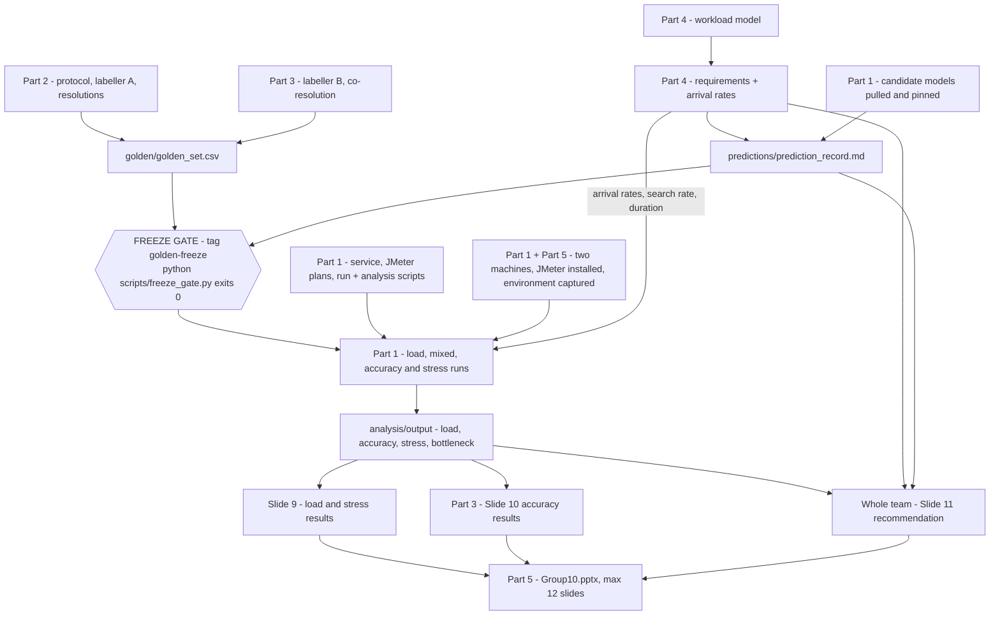

# ICT3113 Performance Optimisation and Design — Assignment 1 — Team 10

**Module:** ICT3113 Performance Optimisation and Design
**Assignment:** Assignment 1 — Performance Requirements and Testing (15% of the final mark)
**Team:** Team 10. Our data slice is rows 10000–10999 of the course CSV, already extracted to
[`data/team_rows.csv`](data/team_rows.csv) (1,000 rows). No other rows may be labelled or sent as test traffic.
**Deliverable:** one PowerPoint file named **`Group10.pptx`**, **maximum 12 slides**, plus the supporting files
listed under [Submission checklist](#w3-submission-checklist). Submitted via xSiTe.
**Hard deadline:** **2359, Friday 9 October 2026.** Late submissions lose 15% per day and nothing at all is
accepted after Tuesday 13 October 2026.

This file is the team's working agreement: if a task is not on this list, nobody is doing it. Tick a box only
when the work is actually in the repository — the marker reads the repository, not our intentions.

**Owner:** Part 1 — Yeo Kai Yuan maintains this file; each owner ticks their own boxes and adds any task this
list has missed. **Done looks like:** every box below ticked, and `Group10.pptx` plus its supporting files
submitted on xSiTe.

Host commands in this file are written as `python ...`. On a development machine use the project virtualenv:
`.venv/bin/python ...` and `.venv/bin/pytest`. Nothing needs to be installed; the virtualenv already has
FastAPI, uvicorn, httpx, pydantic, python-dotenv, pytest, pandas, matplotlib and PyYAML.

---

## INTERNAL DEADLINES — read this first

| When | Gate | What must be true | Immovable? |
|---|---|---|---|
| **Tue 29 Sep 2026** | **FREEZE GATE** | `golden/golden_set.csv` and `predictions/prediction_record.md` are committed and the commit is tagged `golden-freeze`, so `python scripts/freeze_gate.py` exits 0. The prediction record cannot be written until `workload/requirements.md` and the candidate model list are final, so those are in scope for this date too. | **YES — this one cannot move** |
| Fri 2 Oct 2026 | Benchmarks complete | All load runs (three runs per configuration), all accuracy runs and the stress run are in `results/runs/` and `results/accuracy/`, and the analysis tables are in `analysis/output/`. | No, but slipping it eats the writing time |
| Tue 6 Oct 2026 | Slide drafts in | Every owner's slides drafted in `slides/` and reviewed by at least one other member. | No |
| **Fri 9 Oct 2026, 2359** | **Submit** | `Group10.pptx` plus supporting files uploaded to xSiTe. | **YES — set by the module** |

**The calendar reality.** Today is Wednesday 23 September 2026. There are **16 days** to the deadline, and the
four gates above are only three to seven days apart: roughly one working week from today to the freeze, then
ten days from the freeze to submission, with the benchmark, writing and review gates packed into those ten
days. There is no slack anywhere in that schedule.

**Why the freeze gate is the only immovable internal date.** The brief forbids any benchmark run before the
golden set and the prediction record are committed, and the commit history is the evidence that our labels and
predictions predate our measurements. Everything in the second half of Part 1 — every load run, every accuracy
run, the stress test, the bottleneck diagnosis, Slides 9, 10 and 11 — is blocked behind that single gate. A day
lost before the freeze is a day lost from measurement, not a day borrowed from writing. If the freeze slips,
the work that slips with it is the 5% marked as "measurement and recommendation".

---

## Team roster

| Part | Owner | Slides | Works mainly in |
|---|---|---|---|
| Part 1 — technical core (service, tests, analysis) | **Yeo Kai Yuan** | 1, 2, 5, 9 | `service/`, `scripts/`, `jmeter/`, `analysis/`, `models/` |
| Part 2 — golden set lead, labeller 1 | **Teammate A** — TODO(Yeo Kai Yuan): replace with real name | 6 (with B) | `labelling/`, `golden/` |
| Part 3 — labeller 2, accuracy results | **Teammate B** — TODO(Yeo Kai Yuan): replace with real name | 6 (with A), 10 | `labelling/`, `analysis/output/accuracy/` |
| Part 4 — workload model and requirements | **Teammate C** — TODO(Yeo Kai Yuan): replace with real name | 3, 4 | `workload/` |
| Part 5 — environment, playbooks, deck | **Teammate D** — TODO(Yeo Kai Yuan): replace with real name | 7, 8, 12 | `docs/environment/`, `docs/playbooks/`, `slides/` |
| Slide 11 (predictions, recommendation, defence) | whole team | 11 | `predictions/` |

The four placeholder names are placeholders because the real names are not recorded anywhere in this
repository yet. Slide 1 must carry every member's **full name and student ID**, so this is on the critical path
for Slide 1, not an afterthought.

- [ ] TODO(Yeo Kai Yuan): collect the four real names and student IDs, replace every `Teammate A/B/C/D`
      placeholder in this file, and hand the list to Part 5 for Slide 1.

Slide content is specified slide by slide in `slides/outline.md`: required content, owner, the files each slide
draws its numbers from, and what "done" means for that slide. Every owner builds their slides from that file;
this list only says who does it and when.

---

## Part 1 — Yeo Kai Yuan (technical core; Slides 1, 2, 5, 9)

A ticked box here means the artefact is on disk in this repository, checked file by file on 23 September 2026.
It does **not** mean it has been exercised against a running model: no model may be run before the freeze
except one smoke test on the 28 hand-written synthetic tickets in `data/dev/synthetic_tickets.csv`. Anything
needing real hardware, a model pull, or Yeo Kai Yuan's judgement is left unticked on purpose.

### 1.1 Repository, Docker and compose setup

- [x] Repository skeleton with tooling config: `.gitignore`, `pyproject.toml` (pytest config and
      `pythonpath = ["."]`), `requirements.txt` (service runtime) and `requirements-dev.txt` (host tooling).
- [x] Team slice extracted and committed —
      `python scripts/extract_team_rows.py --csv ict3113_tickets.csv --team 10` produced
      `data/team_rows.csv` (1,000 rows, columns `row_number,narrative,raw_label`). The full course CSV stays
      gitignored.
- [x] Dev-only synthetic tickets written to `data/dev/synthetic_tickets.csv` (rows 900000–900027) so that
      everything can be exercised before the freeze without a single team row reaching a model.
- [x] `Dockerfile` and `docker-compose.yml` defining the triage service and the Ollama backend, with the
      SQLite database in a named volume and `./logs/service` bind-mounted into the container.
- [x] `.env.example` committed with every variable, its default and a one-line comment (`OLLAMA_BASE_URL`,
      `MODEL_TAG`, `MODEL_DIGEST`, `NUM_CTX`, `OLLAMA_TIMEOUT_S`, `OLLAMA_SEED`, `DB_PATH`, `LOG_DIR`,
      `SERVICE_HOST`, `SERVICE_PORT`, `UVICORN_WORKERS`, `SERVICE_THREADPOOL_SIZE`, `LOG_LEVEL`, plus
      `OLLAMA_NUM_PARALLEL` and `OLLAMA_MAX_LOADED_MODELS`, which are the only concurrency limits in the whole
      system and therefore part of every run's metadata). `.env` itself is gitignored.
- [ ] Write the root `README.md` — **not yet in the repository, and it is the entry point a marker opens
      first.** It must cover: how to build and run the stack with `docker compose`, the one-worker choice, the
      absence of any concurrency limit in the service and why we therefore expect the bottleneck to land in
      Ollama, the normalisation rules in `service/categories.py`, and the repository layout. The per-folder
      READMEs (`labelling/README.md`, `workload/README.md`) already exist and can be linked rather than
      repeated.
- [x] `scripts/reset.sh [--yes] [--project-name NAME]` to take the stack down and empty the database between
      configurations, so each run starts from an empty service as the brief requires.
- [ ] Bring the stack up on the real service machine and confirm `GET /health` reports
      `ollama_reachable: true`, the expected `model_tag`, `num_ctx` and `prompt_hash`
      (`docker compose up -d --build`, then `curl -s localhost:8000/health`). Needs the actual hardware.
- [ ] Run the one permitted pre-freeze smoke test on synthetic tickets only:
      `scripts/smoke_test.sh --count 5`. It asserts HTTP 200, a valid category and a well-formed log line —
      it deliberately reports no latency and no accuracy.

### 1.2 Triage service with three endpoints and per-request structured logging

The service is `service/main.py` (the FastAPI app and all four routes), with `service/config.py` (environment
settings), `service/db.py` (SQLite), `service/ollama_client.py` (the model call), `service/request_log.py` (the
JSONL request log), `service/prompt.py`, `service/categories.py` and `service/log_schema.py` around it.

- [x] `POST /tickets` — synchronous classification: the request does not return until the model has answered.
      No caching, no queuing, no batching. Stores the ticket and returns `{"id", "category", "request_id"}`.
      On a model failure it returns HTTP 502 and does **not** store the ticket, so `GET /stats` cannot be
      corrupted by failed classifications.
- [x] `GET /search?q=...&limit=50` — case-insensitive `LIKE` scan over the stored narratives, `limit` clamped
      to 1–500.
- [x] `GET /stats` — total plus per-category counts in canonical order, including `UNPARSEABLE` and
      zero-count categories.
- [x] `GET /health` — model tag and digest, `num_ctx`, prompt hash, Ollama reachability, worker and
      threadpool counts, database path and the category list. Not written to the request log, because at load
      it would swamp it.
- [x] One fixed classification prompt in `service/prompt.py` with `PROMPT_HASH` derived from the template, so
      every log line records which prompt produced it. No few-shot examples in the baseline.
- [x] Category normaliser in `service/categories.py` with its seven numbered rules documented in the module
      docstring, and `UNPARSEABLE` for anything that does not map to exactly one category.
- [x] Per-request JSONL logging to `logs/service/<UTC-date>.jsonl`, exactly the 24 keys of
      `LOG_FIELDS` in `service/log_schema.py`, including Ollama's own nanosecond timings copied through
      verbatim. This log is the evidence base for every number we report.
- [x] Tests pass: `.venv/bin/pytest` (schema, normaliser, endpoint behaviour with the model call stubbed —
      no model is contacted by the test suite).
- [ ] Walk the log line field by field against `service/log_schema.py` once, with the service actually
      running, and confirm a real line validates (the schema test proves the shape; this proves the writer).

### 1.3 Candidate model shortlist (three to five models, at least two size classes)

- [x] Shortlist **proposed**: four candidates spanning three parameter size classes, plus two named
      substitutes, machine-readable in `models/models.yaml` with an empty `pinned:` block per model, and
      justified model by model with licences and sources in `models/candidates.md`. *(Remaining work is a
      decision, not construction: the shortlist is a proposal until Yeo Kai Yuan confirms it — see the
      confirmation block at the top of `models/candidates.md`.)*
- [ ] TODO(Part 1 — Yeo Kai Yuan): work through the confirmation block in `models/candidates.md` and confirm
      or change the set. The brief asks for the trade-off between small-and-fast and large-and-accurate to be
      visible, not avoided, so check the set still makes it visible after any substitution.
- [ ] TODO(Part 1 — Yeo Kai Yuan): settle the open quantisation question recorded in `models/candidates.md`
      (the default builds do not use the same quantisation across the size classes, which confounds the
      comparison unless we either accept it and say so, or pin a matched build).
- [ ] Pull and pin every candidate on the Ollama host —
      `scripts/pull_and_pin_models.sh --models-file models/models.yaml` — and paste the resolved **digest**
      for each tag back into `models/models.yaml`. Tag alone is not a pin.
- [ ] Record each model's licence and parameter count for Slide 5 and hand them to Part 5 for Slide 12.
- [ ] Confirm the pinned digests in `models/models.yaml` match what `GET /health` reports during the runs.

### 1.4 JMeter plans (open-loop only)

- [x] `jmeter/load_post_tickets.jmx` — Open Model Thread Group, arrival rate driven by
      `${__P(rate_per_min,60)}`, narratives read from `${__P(input_csv,...)}` by a CSV Data Set Config, JSON
      body escaped by a JSR223 pre-processor, Response Assertion on HTTP 200 only (no client-side category
      assertion — that would be measuring accuracy in the load generator).
- [x] `jmeter/mixed_load.jmx` — two Open Model Thread Groups in one plan: `POST /tickets` at `rate_per_min`
      and `GET /search` at `search_rate_per_min`, search terms from `data/search_terms.txt`.
- [x] `jmeter/stress_ramp.jmx` — one stepped open-loop ramp, step rates and step duration driven by
      `${__P(...)}` properties, with the step boundaries recorded in the plan comments and in
      `docs/playbooks/stress-test.md` so `analysis/stress_summary.py` can be told where the steps fall.
- [x] `data/search_terms.txt` — the search terms used by the mixed plan.
- [x] `jmeter/user.properties` — the JMeter properties every run is launched with (`-q jmeter/user.properties`),
      so the `.jtl` column set is ours and not whatever happens to be installed on the machine running the
      test. `analysis/` depends on those columns being present.
- [x] Every plan carries a `TestPlan.comments` note explaining why there is no closed-loop thread group
      anywhere: closed-loop traffic self-throttles when the server slows, hides queue build-up, and the brief
      states such results will not be accepted as evidence.
- [x] Every plan sets per-iteration `request_id` and `source_row` variables and sends them as `X-Request-ID`
      and `X-Source-Row`, so each `.jtl` sample can be joined to the service log line it produced.
- [ ] Open each of the three plans in non-GUI mode on the load generator (`jmeter -n -t <plan> ...`) and fix
      anything JMeter complains about. Needs JMeter 5.6+ installed on that machine.

### 1.5 Run scripts and the accuracy runner

- [x] `scripts/run_load_test.sh --plan <load_post_tickets|mixed_load|stress_ramp> --model <tag>
      --rate <per_min> --duration <seconds> [--runs 3]` — three runs per configuration by default, one
      warm-up request per run excluded from the analysis, and one directory per run under `results/runs/`
      holding `metadata.json`, `freeze.json`, `results.jtl`, `jmeter.log`, `service.jsonl`, `warmup.jsonl`
      and `jmeter_stdout.txt`.
- [x] The run script refuses to run against team rows unless the freeze gate passes, and in `--dev` mode uses
      only `data/dev/synthetic_tickets.csv`, writes only under `results/dev/` and prints a banner saying the
      results are not evidence.
- [x] `python scripts/run_accuracy.py --model <tag>` — sends every golden-set ticket through `POST /tickets`
      once and records `row_number,request_id,http_status,predicted_category,error` per ticket under
      `results/accuracy/`. It scores nothing; scoring is `analysis/accuracy.py`.
- [x] `python scripts/freeze_gate.py [--json]` — the single implementation of the freeze check, importable by
      the run scripts and callable from the shell. See [Definition of done](#definition-of-done--the-freeze-gate).
- [x] `scripts/capture_env.sh --role service|ollama|loadgen|all` — writes the hardware and software facts of
      a machine into `docs/environment/`, for Part 5's Slide 7.
- [ ] Rehearse the whole pipeline end to end in `--dev` mode on synthetic tickets before the freeze, so that
      freeze day is not the first time the scripts are run in anger. Needs the stack running.

### 1.6 Analysis scripts

- [x] `analysis/common.py` — shared readers for `.jtl` files and service logs, run-directory parsing,
      percentile and spread helpers, table writers. Everything else imports these rather than re-implementing.
- [x] `python analysis/summarise_load.py --runs results/runs` — p50, p95, p99, achieved throughput and error
      rate per configuration, plus the mean and spread across the three runs.
- [x] `python analysis/reconcile.py --run-dir results/runs/<dir>` — joins the JMeter `.jtl` to the service
      log on `request_id` and exits non-zero if samples cannot be matched or the two clocks disagree beyond
      the threshold. This is what makes "every number reconciles with the logs" a checkable claim.
- [x] `python analysis/accuracy.py --results results/accuracy --golden golden/golden_set.csv` — overall and
      per-category accuracy plus the confusion matrix, per model, on the canonical category axes.
- [x] `python analysis/stress_summary.py --run-dir results/runs/<dir> --step-seconds 120` — per-step latency
      and error rate for the ramp, and the step at which the stated limit is breached.
- [x] `python analysis/bottleneck_hints.py --run-dir results/runs/<dir>` — splits our own wall-clock latency
      against Ollama's reported `prompt_eval`/`eval` durations to show where the time actually goes.
- [x] Analysis tests pass on fabricated evidence: `.venv/bin/pytest analysis/tests`.
- [ ] After the runs: check every derived table in `analysis/output/` against the raw files and confirm no
      figure in the deck exists outside these outputs.

### 1.7 A separate load-generator machine

The brief is explicit that a co-hosted load generator produces fiction. This is a hardware task, not a code
task, and it is the most likely thing to be left too late.

- [ ] TODO(Part 1 — Yeo Kai Yuan): decide which two machines we use — one running the service and Ollama, one
      running JMeter — and write the decision into `docs/environment/`.
- [ ] Install JMeter 5.6 or newer on the load generator (5.6+ is required for the Open Model Thread Group)
      and record the exact version; it goes into every `metadata.json`.
- [ ] Confirm the load generator can reach the service over the network, and measure the idle round-trip time
      so we can say what the network contributes.
- [ ] Capture both machines' hardware and software facts: `scripts/capture_env.sh --role loadgen` on the
      generator and `scripts/capture_env.sh --role all` on the service host. Hand the output to Part 5.
- [ ] Confirm Ollama is running CPU-only, and record `OLLAMA_NUM_PARALLEL` and `OLLAMA_MAX_LOADED_MODELS` —
      with no concurrency limit in the service, those two settings are the real queue.

### 1.8 After the freeze gate passes — run everything

Nothing in this block may start before `python scripts/freeze_gate.py` exits 0.

- [ ] Confirm the freeze: `python scripts/freeze_gate.py --json` exits 0, and keep its output.
- [ ] Run the accuracy test for every candidate model: `python scripts/run_accuracy.py --model <tag>` once per
      model against `golden/golden_set.csv`.
- [ ] Run `jmeter/load_post_tickets.jmx` at every arrival rate Part 4's requirements ask for, for every
      candidate model, **three runs each**: `scripts/run_load_test.sh --plan load_post_tickets --model <tag>
      --rate <per_min> --duration <seconds> --runs 3`.
- [ ] Run `jmeter/mixed_load.jmx` at the peak rate with the agent search rate from the workload model, three
      runs, so we can state `GET /search` latency under mixed load.
- [ ] Run the stress test: `scripts/run_load_test.sh --plan stress_ramp --model <tag> --rate <first step
      per_min> --duration <seconds>` (for `stress_ramp`, `--rate` is the first step's rate), then
      `python analysis/stress_summary.py --run-dir results/runs/<dir> --step-seconds <step duration>` to name
      the limit found.
- [ ] Reconcile every run: `python analysis/reconcile.py --run-dir results/runs/<dir>` for each directory. A
      non-zero exit here must be fixed, not reported around.
- [ ] Summarise: `python analysis/summarise_load.py --runs results/runs` and
      `python analysis/accuracy.py --results results/accuracy`.
- [ ] Diagnose the bottleneck with `python analysis/bottleneck_hints.py --run-dir results/runs/<dir>` plus the
      service logs, and write the diagnosis up for Slide 9. The brief wants it diagnosed and stated, not fixed
      — fixing it is Assignment 2.
- [ ] Note plainly any requirement no candidate meets, and pass that to the Slide 11 discussion.

### 1.9 Team walkthrough

- [ ] Run a walkthrough for the whole team, before the freeze, covering: the architecture and where each
      component runs, the three endpoints, the log line field by field against `service/log_schema.py`, where
      results land under `results/`, and how to read `analysis/output/`.
- [ ] In the same session, explain the `A2 candidate:` comments: each one marks a deliberate
      non-optimisation, and together they are the shortlist we start Assignment 2 from.
- [ ] Make sure at least one other member can run `scripts/run_load_test.sh` unaided — Part 5 does exactly
      that in [5.3](#53-run-one-test-yourself).

### 1.10 Slides 1, 2, 5 and 9

- [ ] **Slide 1 — Cover.** Group number, all names and student IDs, a concise project title, and the GitHub
      repository link. Blocked on the real names and student IDs, and on the repository being pushed.
- [ ] **Slide 2 — Service architecture.** Component diagram (load generator, triage service, Ollama, SQLite),
      the three endpoints and what each does, and the explicit statement that the baseline is synchronous with
      no caching and no queuing.
- [ ] **Slide 5 — Candidate models.** Each candidate with its Ollama tag **and digest** from
      `models/models.yaml`, the size classes spanned, and the justification for the set.
- [ ] **Slide 9 — Load and stress results.** p50, p95, p99, achieved throughput and error rate at each tested
      arrival rate, per model, across three runs with the spread shown; the stress test and the limit it
      found; and the diagnosed bottleneck. Every figure taken from `analysis/output/`.

---

## Part 2 — Teammate A (golden set lead, labeller 1; Slide 6)

TODO(Yeo Kai Yuan): replace "Teammate A" with the real name.

Part 2 sets the pace of the whole assignment: the freeze gate cannot pass until the golden set is finished, and
nothing may be measured until the freeze gate passes. Start on day one; no code is needed for any of it.

**Ownership note.** `labelling/README.md` allocates running `labelling/scripts/agreement.py`, writing up the
resolutions and running `labelling/scripts/build_golden_set.py` to Part 3; this list allocates them to Part 2
as the golden-set lead, with Part 3 co-resolving. Either split works and neither is more correct, but the two
documents must not disagree.
TODO(Yeo Kai Yuan): choose one split and correct the other document.

### 2.1 Write the labelling protocol first

- [ ] Read `labelling/README.md` — it gives the order of work, the commands and the deadline for Parts 2 and 3
      in two pages.
- [ ] Fill in the template at `labelling/protocol.md` **before labelling anything**: a definition of each of
      the seven categories in our own words, with the boundary each definition draws against its nearest
      neighbour.
- [ ] TODO(Part 2 — Teammate A): write the edge-case rules — what to do with a ticket that fits two
      categories, one that fits none, and one that is too vague to judge. State the rule, not an example.
- [ ] TODO(Part 2 — Teammate A): record the rule on the noisy consumer `raw_label`. The label sheets exclude
      that column by design, so the protocol should say that labellers do not see it and why — the
      consumer-selected labels are the noise the golden set exists to remove. If you decide otherwise, say so
      explicitly and say how you will stop it anchoring your labels.
- [ ] Record the protocol version and keep a dated revision log at the bottom of the file — Slide 6 must show
      the protocol *and its revisions*, so the revisions must be visible, not smoothed away.
- [ ] Agree the protocol with Teammate B before either of you labels a ticket, and note the date you did.

### 2.2 Draw the candidate sample

- [ ] Draw the candidates: `python labelling/scripts/sample_golden_candidates.py --n 200 --seed 3113`. It
      writes `labelling/golden_candidates.csv` (`row_number,raw_label` — the audit trail of what was sampled)
      and the two blank sheets `labelling/labeller_A.csv` and `labelling/labeller_B.csv`
      (`row_number,narrative,label,confidence,notes`). The seed is fixed at 3113 so the sample is reproducible
      and provably not cherry-picked; do not change it without recording why. *(The sheets have already been
      generated once with the default seed and sample size, so labelling can start immediately; re-run only if
      you change `--n`, and say why in `labelling/protocol.md`.)*
- [ ] Confirm the sample size lands the finished golden set in the 150–200 tickets the brief requires, after
      any tickets you decide to drop.
- [ ] Commit the candidate sheets so the sampling provably predates the labelling in the commit history.

### 2.3 Label independently (labeller 1)

- [ ] Label every sampled ticket into `labelling/labeller_A.csv`, following the protocol, **without
      conferring with Teammate B**. Fill `label` with one of the seven category names spelled exactly as in
      `service/categories.py`, and use the `confidence` and `notes` columns — the low-confidence rows are
      where the protocol is weakest.
- [ ] Do not open `labelling/golden_candidates.csv` or `data/team_rows.csv` while labelling. Both carry the
      noisy consumer `raw_label`, and seeing it would anchor your judgement to the noise the golden set exists
      to remove.
- [ ] Note any ticket where the protocol did not give you an answer — that note is the input to the protocol
      revision, and it is also Slide 6 material.
- [ ] Commit your sheet before you look at Teammate B's.

### 2.4 Agreement statistic

- [ ] Compute Cohen's kappa with the provided script, keeping its report:
      `python labelling/scripts/agreement.py --a labelling/labeller_A.csv --b labelling/labeller_B.csv
      > labelling/agreement_report.txt`. It refuses to score incomplete sheets, prints the arithmetic and the
      two-labeller confusion matrix, and writes `labelling/disagreements.csv`.
- [ ] Commit `labelling/agreement_report.txt` — it is one of the submitted supporting files — and quote the
      figure on Slide 6. Report it as it comes out. A suspiciously perfect agreement with no recorded
      resolutions will be examined closely by the marker.
- [ ] Use `labelling/disagreements.csv` as the worklist for the resolution meeting, so no disagreement is
      quietly skipped.

### 2.5 Lead disagreement resolution

- [ ] Meet Teammate B and resolve **every** disagreement by discussion.
- [ ] Record each resolution twice, as the templates expect: the reasoning in `labelling/resolutions.md` (the
      human record, and where Slide 6's worked examples are quoted from) and the machine-readable row in
      `labelling/resolutions.csv`, which `build_golden_set.py` consumes. One entry per disagreement; no silent
      overrides.
- [ ] Where a disagreement revealed a gap in the protocol, revise `labelling/protocol.md` and log the
      revision. Say which resolution caused which revision.
- [ ] Pick one or two resolutions that show the reasoning well — Slide 6 asks for examples.

### 2.6 Assemble the final golden set

- [ ] Build it with the script rather than by hand:
      `python labelling/scripts/build_golden_set.py --a labelling/labeller_A.csv
      --b labelling/labeller_B.csv --resolutions labelling/resolutions.csv --out golden/golden_set.csv`. It
      writes `row_number,label`, checks every row against `data/team_rows.csv`, and refuses to rebuild a set
      that has already been frozen.
- [ ] Check the row count is between 150 and 200 and that every ticket is identified by its `row_number` from
      our team slice (10000–10999).
- [ ] Commit `labelling/protocol.md`, both label sheets, `labelling/resolutions.csv` and the agreement output
      now; `golden/golden_set.csv` goes in the freeze commit with the prediction record, and nothing else goes
      in that commit. Then run `python scripts/freeze_gate.py` and read what it still wants. See
      [Definition of done](#definition-of-done--the-freeze-gate).

### 2.7 Slide 6 (with Teammate B)

- [ ] **Slide 6 — Golden test set.** Summary of the protocol and its revisions, the agreement statistic, the
      number of disagreements and how they were resolved, with one or two examples.

---

## Part 3 — Teammate B (labeller 2 and accuracy results; Slide 6 with A, Slide 10)

TODO(Yeo Kai Yuan): replace "Teammate B" with the real name.

### 3.1 Independent labelling (labeller 2)

- [ ] Read `labelling/README.md` for the order of work, then read `labelling/protocol.md` and agree it with
      Teammate A before starting. Note the ownership question flagged at the top of Part 2: `labelling/README.md`
      gives you the agreement script, the resolutions write-up and the golden-set build; this list gives them
      to Part 2. Settle it between you before the labelling finishes, not afterwards.
- [ ] Label every sampled ticket into `labelling/labeller_B.csv` **without conferring with Teammate A** and
      without looking at their sheet. The independence is the point: it is what makes the agreement statistic
      mean anything.
- [ ] Check you have labelled every sampled row, using only the seven canonical category names exactly as
      spelled in `service/categories.py`, so the agreement script can match them; fill `confidence` and
      `notes` as you go.
- [ ] Do not open `labelling/golden_candidates.csv` or `data/team_rows.csv` while labelling — both expose the
      noisy consumer `raw_label`, and the independence of your sheet is what the agreement statistic measures.
- [ ] Commit your sheet before comparing with Teammate A.

### 3.2 Co-resolve the disagreements

- [ ] Work through every disagreement with Teammate A and argue your reading; do not simply concede to move
      faster, and record your reasoning in `labelling/resolutions.csv` where it differs.
- [ ] Sanity-check the finished `golden/golden_set.csv` against your own sheet before the freeze — after the
      freeze it cannot be changed.

### 3.3 After the benchmarks: interpret the accuracy results

Blocked until Part 1 has run the accuracy tests. Nothing here needs new code.

- [ ] Read the outputs of `python analysis/accuracy.py --results results/accuracy` in
      `analysis/output/accuracy/`: overall accuracy per model, per-category accuracy per model, and the
      confusion matrix per model.
- [ ] For each candidate model, name the categories it gets wrong most and which category it confuses them
      with. Explain the confusion from the category definitions in `labelling/protocol.md` where you can.
- [ ] Report the `UNPARSEABLE` count per model separately from misclassification: a model that will not answer
      in the requested format is a different failure from a model that answers wrongly, and the client would
      treat them differently.
- [ ] Compare what you found against what the team predicted in `predictions/prediction_record.md` about the
      hardest categories, and write down where the prediction was wrong. The account of being wrong earns
      marks; being right does not.
- [ ] Check every figure you quote appears in `analysis/output/accuracy/`. Nothing typed from memory.

### 3.4 Slide 10

- [ ] **Slide 10 — Accuracy results.** Overall and per-category accuracy on the golden set, per model, plus
      confusion matrix highlights showing where each model goes wrong.

---

## Part 4 — Teammate C (workload model and requirements; Slides 3, 4)

TODO(Yeo Kai Yuan): replace "Teammate C" with the real name.

Part 1 cannot choose the arrival rates to test. They come from this part, and they are needed before the
freeze, so the benchmark plan is ready the moment the gate opens.

### 4.1 Workload model

- [ ] Read `workload/README.md` first — it states the order of work, the exact commands and what "done" means
      for this part, and it is shorter than this section.
- [ ] Fill in the template at `workload/workload_model.md`, covering the four quantities the brief asks for:
      the number of tickets the client receives in a stated period; the rate of agent-side searches; peak
      versus non-peak periods, if they exist; and the expected distribution of ticket lengths.
- [ ] TODO(Part 4 — Teammate C): find and cite a published figure for complaint volume at a financial
      services desk (for example the CFPB's own published complaint statistics). Every figure needs either a
      citation or a stated estimation method — an uncited number is treated as unsupported.
- [ ] TODO(Part 4 — Teammate C): estimate the agent search rate per ticket and show the arithmetic. There is
      unlikely to be a published figure; the estimation method is what is being marked.
- [ ] TODO(Part 4 — Teammate C): state whether the desk has a peak period and how much higher it is than the
      non-peak baseline, with the reasoning.
- [ ] Get the ticket-length distribution from our own data rather than estimating it:
      `python workload/scripts/ticket_length_stats.py --team-rows data/team_rows.csv --out-dir workload/output`,
      and cite the output. These are facts about the dataset, not measurements of a model, so they can be
      produced now.
- [ ] Read the same script's truncation figure (how many of our rows risk exceeding the configured
      `NUM_CTX` of 4096 once the prompt is added) and say in the workload model what it means for the longest
      tickets — a silently truncated ticket is a classification made on partial evidence.
- [ ] Mark clearly, in the document and on Slide 3, which figures are cited and which are estimates.

### 4.2 Testable requirements

- [ ] Fill in the template at `workload/requirements.md`: at least one requirement of each kind, each
      stating a number, a percentile where relevant, and the load condition under which it must hold.
- [ ] TODO(Part 4 — Teammate C): set the response time requirement (for example a p95 for `POST /tickets`, or
      for `GET /search` under mixed load) and justify it from the workload model and from what the desk
      actually needs.
- [ ] TODO(Part 4 — Teammate C): set the throughput requirement (for example tickets classified per hour at
      sustained load) and show it covers the peak, not just the average.
- [ ] TODO(Part 4 — Teammate C): set the accuracy requirement, overall **and** per category, to be measured
      on `golden/golden_set.csv`, and justify it from the staffing cost of a misrouted ticket.
- [ ] Take a position on what costs the client more, a misrouted ticket or a slow triage. The brief does not
      tell us, and Slide 11's recommendation has to follow from whatever position we take here.
- [ ] Name, in each requirement, the analysis script that will produce the number that tests it
      (`analysis/summarise_load.py`, `analysis/accuracy.py` or `analysis/stress_summary.py`). A requirement
      nothing can measure is not testable.
- [ ] **Hand-off to Part 1, before the freeze:** end `workload/workload_model.md` with the explicit list of
      arrival rates in requests per minute that `scripts/run_load_test.sh` will be run at — including at least
      one at or above the modelled peak — plus the agent search rate and the run duration. Part 1 cannot start
      benchmarking until that list exists, and it must not invent it.

### 4.3 Slides 3 and 4

- [ ] **Slide 3 — Workload model.** Ticket volumes, search rates, peak versus non-peak, ticket-length
      distribution, with the source of every figure and the estimation method for every estimate.
- [ ] **Slide 4 — Requirements.** The response time, throughput and accuracy requirements as testable
      statements, each justified from the workload model.

---

## Part 5 — Teammate D (environment, playbooks and deck; Slides 7, 8, 12)

TODO(Yeo Kai Yuan): replace "Teammate D" with the real name.

### 5.1 Test environment write-up

- [ ] Run the capture script on **each** machine and keep its output in `docs/environment/`:
      `scripts/capture_env.sh --role service`, `--role ollama`, `--role loadgen` (or `--role all` where two
      roles share a host).
- [ ] Write the environment description from that captured output: CPU, memory and operating system of each
      machine, the network between them, and the JMeter and Ollama versions.
- [ ] State plainly that the load generator ran on a separate machine from the system under test, and point at
      the captured evidence for it.
- [ ] TODO(Part 5 — Teammate D): write the section on how our results scale to the client's deployment, with
      the assumptions and limitations named — the client's hardware is commodity CPU with no GPUs, and ours is
      not identical to theirs.
- [ ] TODO(Part 5 — Teammate D): list the factors that could make our measurements unrepresentative (shared
      machines, thermal throttling, other load, a laptop on battery, a wireless network between the
      generator and the service).

### 5.2 Playbooks

- [ ] Write one playbook per test in `docs/playbooks/` — the load test, the mixed test, the accuracy test and
      the stress test (`docs/playbooks/stress-test.md` also carries the ramp step boundaries that
      `analysis/stress_summary.py` needs).
- [ ] Each playbook must be followable by a competent tester who cannot ask us anything: the exact commands
      with their flags, the state the service must start in (`scripts/reset.sh --yes`), the warm-up, how many
      runs, what is collected, and where it lands under `results/`.
- [ ] Include the open-loop JMeter configuration explicitly — the Open Model Thread Group and its schedule
      string, and the `-q jmeter/user.properties` that fixes the `.jtl` columns — and say why closed-loop
      generation is not used.
- [ ] Add a diagram or flowchart of the test procedure for Slide 8.

### 5.3 Run one test yourself

- [ ] Run one complete test yourself from your own playbook, with Yeo Kai Yuan watching but not helping, and
      time how long it takes.
- [ ] Every point where you had to ask a question is a defect in the playbook: fix the playbook, do not just
      answer the question.

### 5.4 References and licences

- [ ] Write `docs/references.md` with properly formatted references for the CFPB Consumer Complaint Database,
      Ollama, JMeter and every other source the deck uses.
- [ ] Collect the licence of every candidate model in `models/models.yaml` from Part 1 and include the
      acknowledgement each licence requires. Failing to comply with a model licence is a copyright matter,
      not a presentation detail.
- [ ] Reference the workload sources that Part 4 cites, so Slides 3 and 12 agree with each other.

### 5.5 Deck template and final assembly

**Ownership note.** `slides/outline.md` names Part 1 (Yeo Kai Yuan) as the person who assembles the deck; this
list gives assembly to Part 5 so that the technical core is not also the bottleneck in the last week. Either
works. TODO(Yeo Kai Yuan): decide who assembles, and correct whichever document is then wrong.

- [ ] Work from `slides/outline.md` rather than from the brief directly: it already lists all twelve slides in
      the brief's order with the required content, the owner and the source file for each.
- [ ] Build the deck template in `slides/` following that outline — one slide per numbered requirement, no
      agenda slide and no closing slide, because twelve headings leave no spare slide — and share it with every
      owner by the slide-draft gate (Tue 6 Oct).
- [ ] Assemble `Group10.pptx` from the owners' drafts — **maximum 12 slides**, which means exactly one slide
      per numbered requirement and no extras.
- [ ] Check the file name is exactly `Group10.pptx` and that Slide 1 carries the group number, every name,
      every student ID and the repository link.
- [ ] Do the final read-through against the brief's slide-by-slide requirements, and confirm no figure appears
      on a slide that does not also appear in `analysis/output/`.

### 5.6 Slides 7, 8 and 12

- [ ] **Slide 7 — Test environment.** Hardware and software per machine, confirmation of the separate load
      generator, and how results scale to the client with assumptions and limitations.
- [ ] **Slide 8 — Playbook.** Step-by-step testing procedure including the open-loop JMeter configuration,
      with a diagram.
- [ ] **Slide 12 — References and acknowledgements.** All sources, the Consumer Complaint Database, Ollama and
      the candidate model licences.

---

## Whole team

### W.1 Prediction record meeting — before the freeze

Everyone attends. This is the last thing done before the freeze, and it cannot be revised afterwards.

- [ ] Meet once Part 4's requirements and Part 1's candidate list are settled, and fill in the template at
      `predictions/prediction_record.md` together in that meeting. The template has one section per item the
      brief asks for, plus a sign-off block; Teammate C (Part 4) holds the pen, but the predictions are the
      whole team's.
- [ ] TODO(whole team): state where the bottleneck will be under load **and why**. "Somewhere in the model" is
      not a prediction; name the component and the mechanism.
- [ ] TODO(whole team): for each candidate model in `models/models.yaml`, predict its accuracy on our golden
      set and its single-request latency on our hardware, as numbers with the units stated.
- [ ] TODO(whole team): predict which categories will be hardest to classify and why, from the category
      definitions in `labelling/protocol.md`.
- [ ] Re-read each prediction and ask whether a measurement could prove it wrong. If it cannot, it earns
      nothing — make it sharper before you commit it.
- [ ] Commit the record, then perform the freeze:
      see [Definition of done](#definition-of-done--the-freeze-gate).

### W.2 Recommendation meeting — after the results

- [ ] Meet once `analysis/output/` holds the load, accuracy and stress summaries, and decide which single
      model we recommend to the client.
- [ ] Check the recommendation against `workload/requirements.md` requirement by requirement. A
      recommendation that contradicts our own requirements fails regardless of which model it names.
- [ ] Write down, plainly, any requirement that **no** candidate meets. A carefully measured "no candidate
      meets this" is a strong result, not a failure.
- [ ] Go back through `predictions/prediction_record.md` and account for each prediction that was wrong and
      why. That account is marked; being right is not.
- [ ] **Slide 11 — Predictions, recommendation and defence.** Predictions against outcomes, the recommended
      model defended against our stated requirements, and any requirement no candidate meets.

### W.3 Submission checklist

- [ ] `Group10.pptx`, maximum 12 slides, assembled and proofread.
- [ ] Supporting files in the same submission: the final golden set (`golden/golden_set.csv`, tickets
      identified by row number), the prediction record (`predictions/prediction_record.md`), the labelling
      protocol with its revisions (`labelling/protocol.md`), both independent label sheets
      (`labelling/labeller_A.csv`, `labelling/labeller_B.csv`) and the agreement statistic.
- [ ] Repository pushed, with the `golden-freeze` tag and the raw `.jtl` files and service logs under
      `results/` and `logs/` — they are not submitted, but we may be asked to produce and explain them.
- [ ] Repository link on Slide 1 actually opens, and `docker compose` in it is sufficient to rebuild and run
      the service.
- [ ] Uploaded to xSiTe before 2359 Friday 9 October 2026. Do not leave it to the evening of the ninth.

---

## Dependencies

### What is blocked, and by what

1. **Every benchmark run is blocked on Parts 2, 3 and 4 reaching the freeze gate.** Part 1 may not run a
   single load, accuracy or stress test against our team rows until `golden/golden_set.csv` and
   `predictions/prediction_record.md` are committed and tagged, and the prediction record cannot be written
   until Part 4's requirements and Part 1's candidate list exist. The gate is enforced in code:
   `scripts/run_load_test.sh` and `scripts/run_accuracy.py` call `scripts/freeze_gate.py` and refuse to
   proceed, so this is not a matter of anyone's goodwill.
2. **Part 1 cannot choose the arrival rates.** The rates, the search rate and the run duration come from Part
   4's workload model and requirements (`workload/workload_model.md`, `workload/requirements.md`). Picking
   rates ourselves would mean testing load conditions the requirements never claimed, and the results would
   not answer the question the requirements ask.
3. **Part 3's accuracy interpretation and Slide 10** are blocked on Part 1's accuracy runs, which are blocked
   on the freeze.
4. **Slide 9** is blocked on the load and stress runs. **Slide 11** is blocked on everything: it needs the
   results, the requirements and the frozen predictions together.
5. **Part 5's final assembly of `Group10.pptx`** is blocked on every other owner's slide drafts (gate: Tue
   6 Oct).

### What is NOT blocked — nobody should be idle before the freeze

All of the following can proceed today, and most of it is already in the repository:

- the triage service, its tests and the compose stack (Part 1);
- the three JMeter plans and the run scripts (Part 1) — they can be rehearsed in `--dev` mode against
  `data/dev/synthetic_tickets.csv`, which writes only to the gitignored `results/dev/`;
- all five analysis scripts, which are tested against fabricated evidence and need no real run to be finished;
- the second machine: choosing it, installing JMeter 5.6+ and checking the network (Part 1 and Part 5);
- pulling and pinning the candidate models with `scripts/pull_and_pin_models.sh` (Part 1) — a model may be
  pulled and served before the freeze; what it may not see before the freeze is a team row;
- the environment capture on each machine with `scripts/capture_env.sh` (Part 5);
- the labelling protocol, the sampling, both independent label sheets and the resolutions (Parts 2 and 3) —
  these *are* the freeze, so they are the priority;
- the workload model and the requirements (Part 4);
- the playbooks and the deck template (Part 5).

### Dependency diagram



Read the diagram as: everything above the gate must be finished by Tue 29 Sep; everything below it happens in
the ten days that remain.

---

## Definition of done — the freeze gate

There is one authority on whether the freeze has happened, and it is not a conversation. It is:

```
python scripts/freeze_gate.py            # human-readable explanation, exit 0 if frozen
python scripts/freeze_gate.py --json     # machine-readable, for the run scripts
```

**Exit code 0 and `{"ok": true, ...}` means frozen. Exit code 3 and a list of reasons means not frozen**, no
matter who believes otherwise. The script checks exactly four things:

1. `golden/golden_set.csv` exists, is tracked by git, and has no uncommitted modifications.
2. `predictions/prediction_record.md` exists, is tracked, and has no uncommitted modifications.
3. The git tag `golden-freeze` exists.
4. Both of those files are present **in the tagged commit's tree** — that is, they were committed at or before
   the tag, which is the evidence that our labels and predictions predate every measurement.

On success it prints the freeze commit, the tag, the blob hash of each file and the golden-set row count. On
failure it prints the reasons and the exact command to fix each one.

### The freeze, step by step

- [ ] Golden set final: `golden/golden_set.csv` built by `labelling/scripts/build_golden_set.py`, 150–200 rows
      (Part 2).
- [ ] Protocol, both label sheets, `labelling/resolutions.csv` and the agreement output committed (Parts 2
      and 3).
- [ ] `workload/workload_model.md` and `workload/requirements.md` final, including the arrival rates Part 1
      will test (Part 4).
- [ ] `models/models.yaml` holds the final candidate set with tag **and digest** for each (Part 1).
- [ ] Everything above — protocol, sheets, resolutions, workload model, requirements, `models/models.yaml` —
      committed **first**, in its own commits.
- [ ] `predictions/prediction_record.md` written in the prediction meeting, then one final commit containing
      **only** `golden/golden_set.csv` and `predictions/prediction_record.md`. Nothing else belongs in that
      commit: it is the commit the marker will look at (see "How to freeze" in the prediction record itself).
- [ ] Tag that commit:
      `git tag -a golden-freeze -m "Golden set and prediction record frozen before the first benchmark run"`.
- [ ] `python scripts/freeze_gate.py --json` exits 0. Paste its output into the team channel — that JSON is
      the moment of the freeze.
- [ ] Push the commit **and the tag** (`git push --follow-tags`), so the evidence is not only on one laptop.

Every run directory created afterwards stores the same JSON verbatim as `freeze.json`, so each individual run
carries its own proof that it happened after the freeze.

### Before the freeze, use dev mode

`scripts/run_load_test.sh --dev` and `python scripts/run_accuracy.py --dev` bypass the gate on purpose, so that
the pipeline can be rehearsed. Dev mode reads only `data/dev/synthetic_tickets.csv`, writes only under the
gitignored `results/dev/`, stamps `"mode": "dev"` into its metadata, prints a banner saying so, and refuses to
touch `data/team_rows.csv` or `golden/`. **Dev-mode output is never evidence and must never appear on a
slide.**
